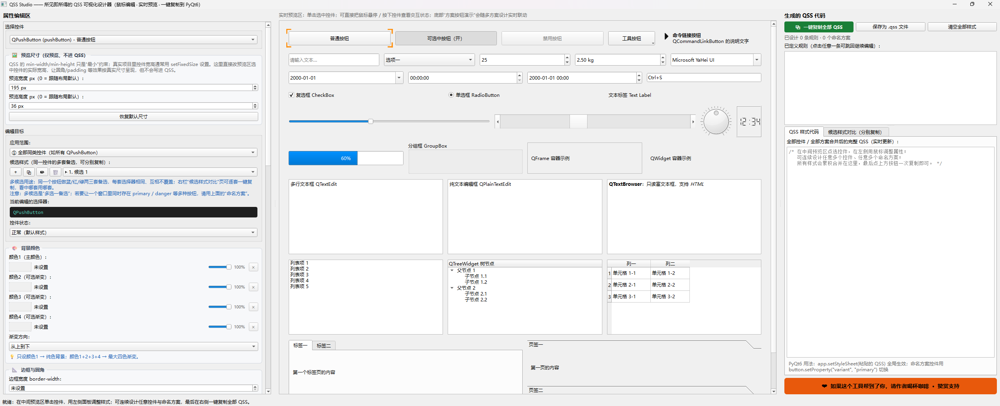

# QSS Studio

> 所见即所得的 **Qt 样式表（QSS）可视化设计器**：用鼠标点选控件、拖动调整颜色 / 边框 / 圆角 / 字体 / 间距，实时预览效果，一键复制可直接用于 PyQt6 / PySide6 项目的 QSS 代码。

纯 Python 单文件实现，基于 PySide6。



## 功能特性

- **所见即所得**：左侧属性面板用鼠标调色、拉滑块，中间预览区实时呈现最终效果
- **点选即编辑**：预览区内 40+ 常用 Qt 控件（按钮、输入框、下拉框、列表、表格、树、选项卡、进度条、分组框等），单击任意控件即可开始设计它的样式
- **完整交互状态**：正常 / `:hover` / `:pressed` / `:focus` / `:checked` / `:disabled` 六种伪状态分别编辑
- **三种选择器作用域**：控件类（如 `QPushButton`）、命名方案 variant（如 `QPushButton[variant="primary"]`）、对象名（如 `#btnOk`）
- **多套候选样式**：同一个控件可并行维护多套互不影响的备选 QSS，并排对比、逐套复制
- **丰富的样式属性**：
  - 前景 / 背景颜色，支持 1–4 色线性渐变与方向设置
  - 四方向独立的边框宽度与颜色，圆角半径
  - 字体族、字号、粗细、斜体、字间距 / 词间距
  - 内边距、外边距、背景图片（平铺 / 拉伸 / 定位）、图标
  - 选中文字颜色（`selection-color` / `selection-background-color`）
- **一键产出**：全部控件、全部方案合并为一份完整 QSS，一键复制或保存为 `.qss` 文件
- **免安装绿色版**：可打包成单个 exe，拷到任何 Windows 机器双击即用，无需安装 Python

## 适用的 Qt 环境

导出的 QSS 语法在 **PyQt5 / PyQt6 / PySide2 / PySide6** 之间通用。

## 快速开始（从源码运行）

需要 Python 3.9+（开发环境为 Python 3.12 + PySide6 6.11）：

```bash
pip install -r requirements.txt
python qss_designer.py
```

## 打包为单文件 exe（免安装绿色版）

```bash
pip install pyinstaller
pyinstaller --onefile --windowed --name "QSS Studio" qss_designer.py
```

产物位于 `dist/QSS Studio.exe`，单个文件即可分发。

> 提示：`--onefile` 首次启动会有数秒解压过程；如追求更快启动，可改用默认的文件夹模式（去掉 `--onefile`）。

## 使用流程

1. 在中间预览区**单击**要设计的控件（也可用左上角下拉框选择）
2. 在左侧面板选择编辑目标（类 / 命名方案 / 对象名）与交互状态
3. 用鼠标调整颜色、边框、圆角、字体、间距等属性，效果实时可见
4. 可继续点选其他控件，所有样式自动累积
5. 在右侧「生成的 QSS 代码」面板一键复制，或保存为 `.qss` 文件

## 在你的项目中应用 QSS

全局生效（推荐）：

```python
app.setStyleSheet(qss_text)          # PyQt6 / PySide6 均可
```

只作用于某个控件：

```python
button.setStyleSheet(qss_text)
```

命名方案（variant）样式需要给控件设置动态属性：

```python
button.setProperty("variant", "primary")
```

## 已知的 Qt/QSS 限制

- `border-radius` 只有在控件同时设置了可见边框（或背景）时才会生效，这是 Qt 样式引擎本身的限制
- QSS 不支持阴影、发光、透明特效，此类效果需通过 Python 代码实现
- 普通 `QWidget` 默认不绘制 QSS 背景，需要设置 `WA_StyledBackground` 属性

## 开源协议

本项目基于 **MIT License** 开源，详见 [LICENSE](LICENSE)。

## 致谢

本软件基于 [PySide6](https://www.qt.io/qt-for-python)（The Qt Company 出品，LGPL-3.0 许可）开发。Qt 与 PySide6 的版权归其各自所有者所有。

## 赞赏支持

如果 QSS Studio 帮你节省了时间，可以自愿请作者喝杯咖啡：

[❤ 爱发电赞赏支持](https://afdian.com/a/oflash)
